# MCA - MuYu Chat Agent

Android local-first AI workspace: mobile-first local inference engines,
user-configured cloud APIs, model management, and image-generation engines under
user control.

[](https://github.com/lyydfys/MCA/actions/workflows/android-ci.yml)
[](https://github.com/lyydfys/MCA/releases)
[](LICENSE)

MCA is an Android-native, local-first AI workspace for people who want direct
control over models, inference backends, and cloud API connections.

The project currently focuses on:

- Local chat engine management with MNN as the mobile-speed-first route and
  GGUF / `llama.cpp` as the compatibility route.
- Cloud chat engines through OpenAI-compatible and Anthropic Messages protocols.
- User-configured web search with source cards and per-turn context injection.
- Local and cloud image-generation engine management.
- ModelScope-oriented model discovery and resumable downloads.
- A Compose mobile UI for chat, model management, image generation, agent
  diagnostics, settings, and local API tools.

MCA does not include model weights or API keys. Users bring their own local
models, cloud endpoints, and provider credentials.

## Screenshots

Real-device screenshots from the Android app:

| Chat | Workspace | Images | Model recommendations |
|---|---|---|---|
| 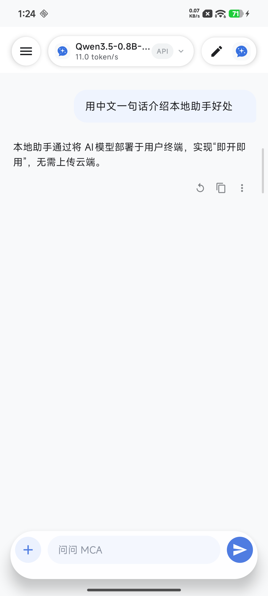 | 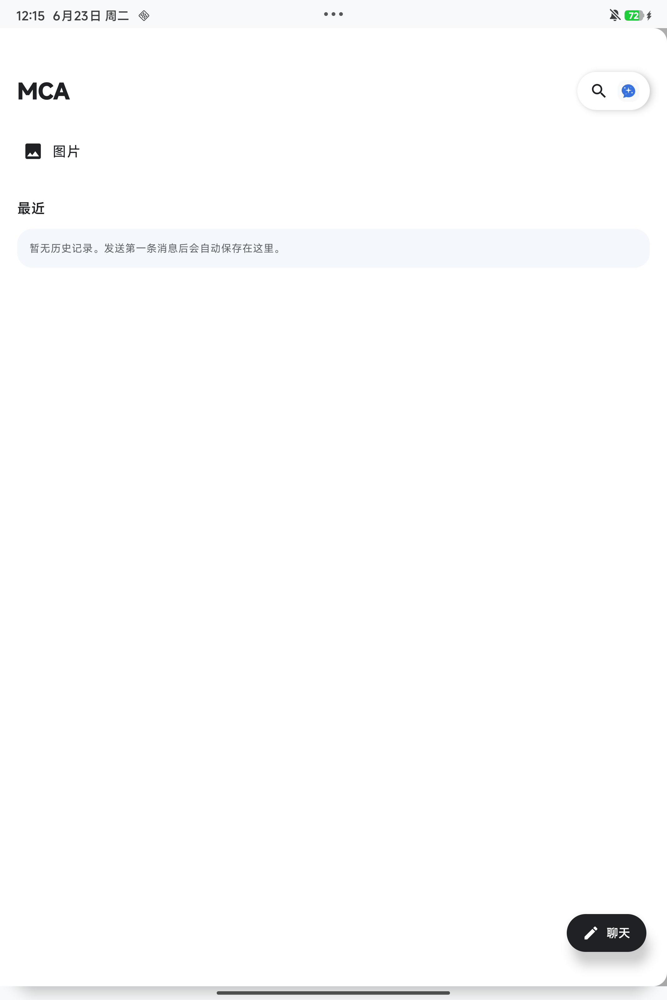 | 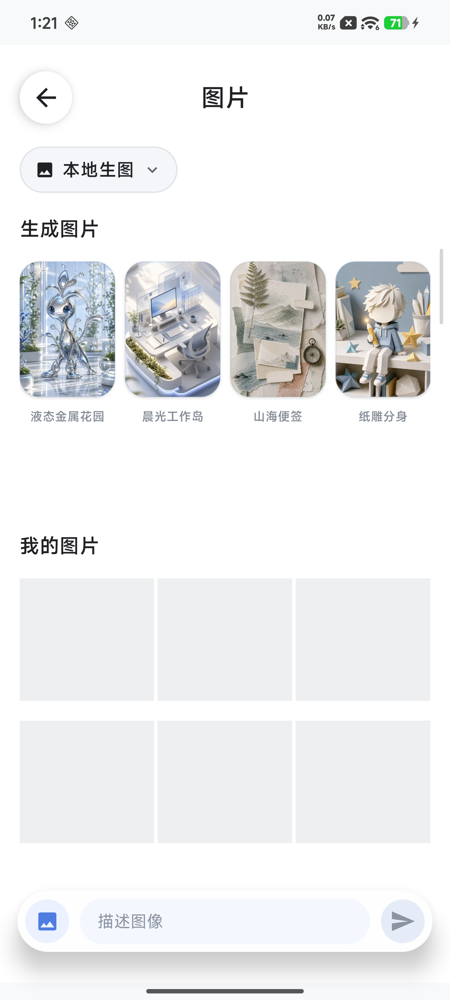 | 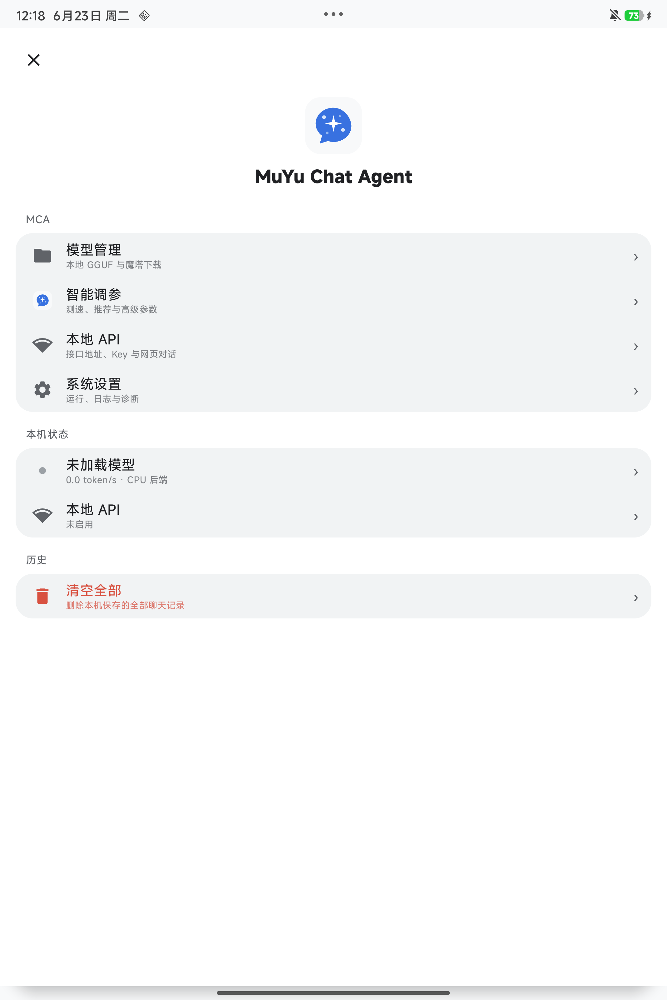 |

<details>
<summary>View more screenshots</summary>

| Settings | Cloud engines | Local engines | Model market |
|---|---|---|---|
| 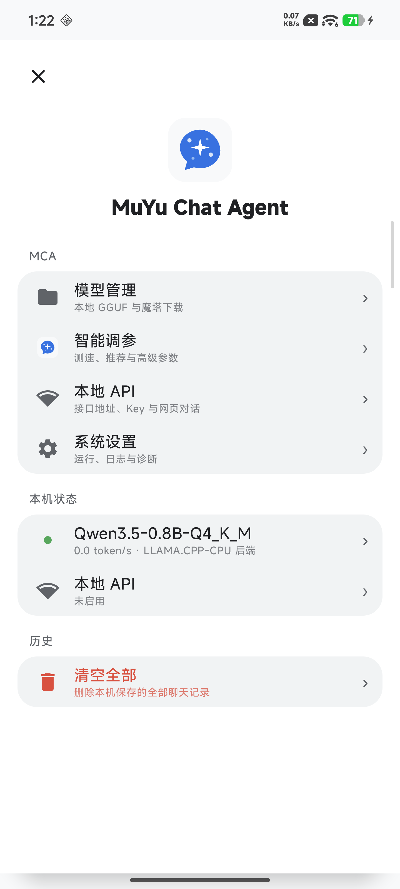 | 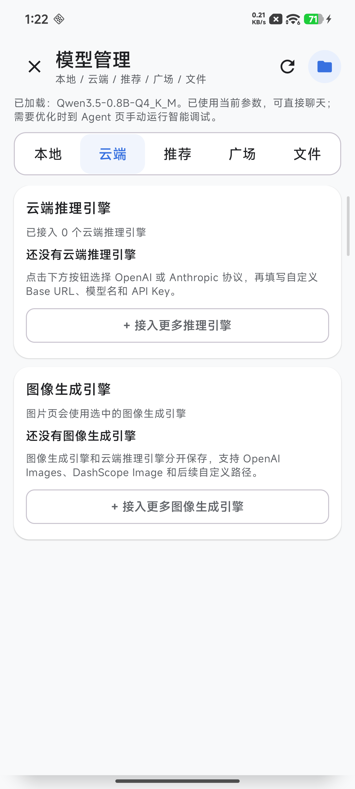 | 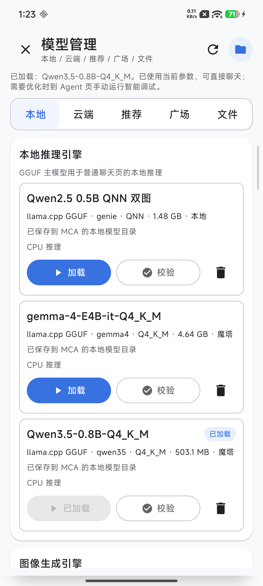 | 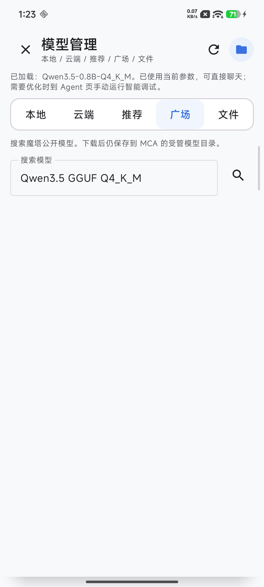 |

| Model picker | Local API |
|---|---|
| 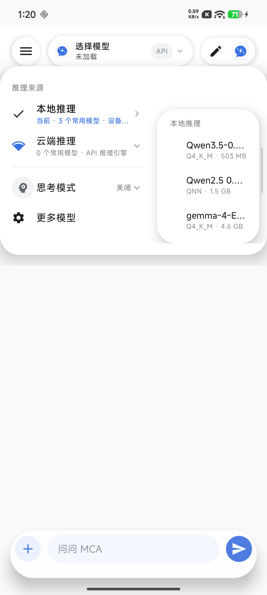 | 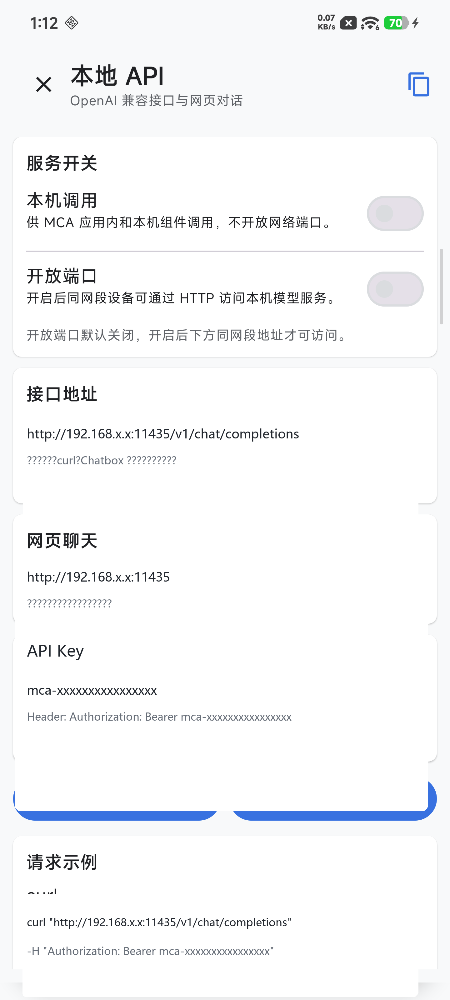 |

The Local API screenshot is redacted before publishing.

</details>

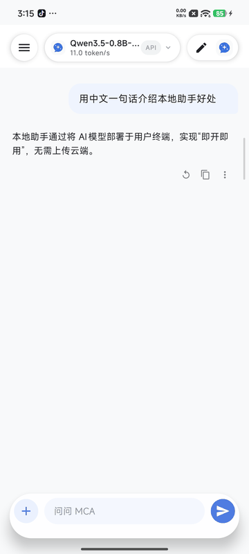

The lightweight GIF above is generated from real-device screenshots. A higher
quality MP4 is available at [docs/assets/demo/mca-demo.mp4](docs/assets/demo/mca-demo.mp4).

## Status

This repository is an active Android app workspace. The chat and model
management surfaces are usable, while local image generation is still
experimental. A complete model bundle is admitted on every compatible device;
its first real native load and graph execution determine compatibility.

Current release status:

- `v0.2.2` is the current stability release. Its notes and verification record are
  in [docs/releases/v0.2.2.md](docs/releases/v0.2.2.md); signed APKs are
  published through [GitHub Releases](https://github.com/lyydfys/MCA/releases).
- The first public package target is `arm64-v8a` Android devices.
- Local chat is the primary stable local path.
- Web search is available after the user configures a search provider in
  Settings. MCA supports manual, smart-auto, and always-on trigger modes for
  SearxNG, Brave Search, Tavily, Jina Search, and custom JSON search endpoints.
- Local image generation is experimental and requires complete model bundles.
  Do not treat phone-side image generation as a guaranteed stable feature yet.
- Snapdragon NPU work is tracked as a gated roadmap, not a blanket claim. See
  [docs/SNAPDRAGON_NPU_ROADMAP.md](docs/SNAPDRAGON_NPU_ROADMAP.md) for the
  device tiers, QNN runtime checks, bundle requirements, and smoke-test gate.

## Features

- **Local chat**: MNN-format recommendations for the mobile-speed-first route,
  GGUF / `llama.cpp` compatibility for existing local models, streaming
  generation, stop support, token speed labels, reasoning-content filtering,
  and local benchmark support. MNN CPU is the preferred route for recommended
  mobile chat bundles; GGUF remains the compatibility route for user-supplied
  models and local vision projector workflows.
- **Cloud chat**: user-configured OpenAI-compatible or Anthropic Messages
  endpoints with locally encrypted API key storage.
- **Vision chat**: cloud multimodal image input for engines explicitly marked
  as image-capable, plus experimental local multimodal GGUF vision when a
  matching `mmproj` projector is loaded. Local projector files can be bound from
  the local model card, downloaded from a model repository and attached to the
  currently loaded main model, or installed as a ModelScope recommendation
  bundle such as MiniCPM-V 4.6 Q4 with its matching projector.
- **Smart web search**: user-configured SearxNG, Brave Search, Tavily, Jina
  Search, or custom JSON search providers. MCA can identify URLs, detect
  explicit search intent, expand time-sensitive or documentation-style queries,
  rank/deduplicate sources, summarize results into the current turn only, and
  display source cards under the assistant reply. Trigger modes are manual,
  smart-auto, and always-on; the Settings page keeps recent local search
  diagnostics for trigger reasons, closed-loop evidence, provider errors,
  partial expanded-query warnings, expanded queries, source counts, latency,
  clickable source URLs, provider labels, source snippets, and a local source
  quality score based on usable sources, readable content length, independent
  hosts, and safety blocks. Direct URL
  reading works after web search is enabled even before a search API is
  configured; keyword search still requires SearxNG, Brave, Tavily, Jina, or a
  custom JSON endpoint. Custom JSON endpoints can use URL templates such as
  `/search?q={query}&limit={max_results}` or common `q/query/max_results`
  parameters. Provider endpoints may be self-hosted, but readable page fetching
  and direct URL reading block localhost, private LAN, link-local, and reserved
  addresses by default for safety. When Jina Search is selected with a
  key, MCA can fall back to Jina Reader for public pages whose direct readable
  content is too weak, while keeping the same private-network guard. MCA reads multiple
  direct URLs, expanded search queries, and fetched page bodies concurrently to
  keep live search responsive on mobile networks. Keyword search successes use
  a short in-memory local cache to avoid repeating the same provider call within
  a brief window; direct URL reads are not cached and API keys are never stored
  in cache entries. The search test in Settings
  uses the fields currently typed into the form, so users can verify an endpoint
  before saving it. The closed-loop self-test records whether MCA produced
  provider results, prompt context, source-card data, quality scoring, and local
  diagnostics. Settings also includes a no-key public JSON self-check filler so
  users can verify the integration path before entering their own provider. MCA
  labels this source as `Public JSON self-check` in the app because it is only a protocol
  check with limited coverage, not a general web-search engine; production use
  should rely on a trusted or self-hosted search service. Custom JSON endpoints may return a top-level array, an
  object containing `results`, `items`, `data`, `hits`, or `organic_results`, or nested
  variants such as `data.results` and `response.items`. It accepts common URL/title fields such as
  `url`, `link`, `href`, `html_url`, `story_url`, `canonical_url`, `displayLink`,
  `formattedUrl`, `source.url`, `title`, `full_name`, `story_title`, and
  `source.title`, plus summary/body fields such as `summary`, `excerpt`, and
  `pageContent`. When smart query expansion creates multiple
  searches, MCA keeps successful sources even if one expanded query fails.
  Tavily and Jina use `Authorization: Bearer <key>`; Brave uses
  `X-Subscription-Token` and supports both the Web Search endpoint and the
  LLM Context endpoint for AI grounding/RAG-style snippets. Public SearxNG
  instances often rate-limit or disable JSON responses, so a self-hosted or
  explicitly approved endpoint is recommended for reliable search.
  Brave and Tavily official API root URLs are accepted and normalized to their
  search paths during preflight and request execution.
- **Image page**: MCA image workspace with local/cloud engine switching,
  prompt composer, generation states, template cards, and image library.
- **Local image engines**: `stable-diffusion.cpp` bridge with progress/cancel
  hooks and bundle-aware model registration. MCA can represent future
  QNN/QAIRT Snapdragon NPU image bundles, but they remain unselectable until
  QNN runtime detection and a real 1-step smoke test pass.
- **Model hub**: local/imported models, ModelScope recommendations, resumable
  downloads, file classification, and engine grouping.
  Hugging Face-hosted recommendations open and download through
  `https://hf-mirror.com` first, with the official Hugging Face endpoint kept
  only as a fallback when the mirror cannot serve the asset.
- **Assistants and role cards**: multiple local assistants with system prompts,
  default model preference, generation parameters, memory/search toggles, and
  JSON role-card import/export. MCA exports its own `mca.assistant.card` schema
  and can import common nested character-card `data` fields into a usable
  system prompt.
- **Agent diagnostics**: local device profiling, model recommendations,
  benchmark-based tuning, and explainable parameter plans.
- **Local API**: OpenAI-compatible local server for trusted same-device and
  same-LAN clients, including `/v1/models`, `/v1/chat/completions`, JSON
  replies, and SSE streaming.

## Install

Download the latest alpha APK from
[GitHub Releases](https://github.com/lyydfys/MCA/releases). Android may ask you
to allow installation from your browser or file manager.

The APK does not include model weights or cloud credentials. After installing:

1. Add a local chat engine or configure a cloud chat engine. MCA recommends MNN
   packages first when an equivalent mobile package exists, and keeps GGUF /
   `llama.cpp` for compatibility. For local vision, use a multimodal
   recommendation bundle such as MiniCPM-V 4.6 Q4, or import a compatible main
   GGUF and bind its matching `mmproj` / projector.
2. Configure an image engine if you want cloud or local image generation.
3. Configure web search in Settings if you want live search. You can use a
   self-hosted SearxNG endpoint, Brave Search, Tavily, Jina Search, or a
   compatible custom JSON endpoint, test the current form values, then choose
   manual, smart-auto, or always-on triggering. Brave can use either
   `/res/v1/web/search` for normal search or `/res/v1/llm/context` for
   grounding-oriented snippets; Brave/Tavily official root URLs are auto-filled
   to the normal search paths. Direct page reading will refuse
   localhost, LAN, link-local, and reserved addresses unless a development build
   explicitly enables private-network fetching. See
   [docs/WEB_SEARCH.md](docs/WEB_SEARCH.md) for the full configuration,
   trigger-mode, source-card, and troubleshooting guide.
   Quick source guide: choose Tavily or Brave for the fastest API-key setup,
   choose self-hosted SearxNG when privacy and control matter most, choose Jina
   when page-body extraction needs help, or choose custom JSON when you operate
   your own search gateway.
4. Check [docs/PERMISSIONS.md](docs/PERMISSIONS.md) before enabling network or
   local API workflows.
5. Check [docs/MODEL_COMPATIBILITY.md](docs/MODEL_COMPATIBILITY.md) before
   choosing local image bundles or cloud provider protocols.

Release APKs are signed by the project maintainer. Debug APKs are not intended
for public installation.

Optional live web-search smoke tests for maintainers:

```powershell
$env:MCA_LIVE_WEB_SEARCH_TEST='true'
.\gradlew :app:testDebugUnitTest --tests com.muyuchat.mca.WebSearchProviderTest.liveDirectUrlSmokeReadsRealWebPageWhenEnabled

$env:MCA_LIVE_SEARXNG_ENDPOINT='https://your-searxng.example'
.\gradlew :app:testDebugUnitTest --tests com.muyuchat.mca.WebSearchProviderTest.liveSearxngSmokeUsesConfiguredEndpointWhenProvided

$env:MCA_LIVE_BRAVE_API_KEY='<key>'
.\gradlew :app:testDebugUnitTest --tests com.muyuchat.mca.WebSearchProviderTest.liveBraveSmokeUsesConfiguredKeyWhenProvided

$env:MCA_LIVE_TAVILY_API_KEY='<key>'
.\gradlew :app:testDebugUnitTest --tests com.muyuchat.mca.WebSearchProviderTest.liveTavilySmokeUsesConfiguredKeyWhenProvided

$env:MCA_LIVE_JINA_API_KEY='<key>'
.\gradlew :app:testDebugUnitTest --tests com.muyuchat.mca.WebSearchProviderTest.liveJinaSmokeUsesConfiguredKeyWhenProvided

$env:MCA_LIVE_CUSTOM_JSON_ENDPOINT='https://hn.algolia.com/api/v1/search'
.\gradlew :app:testDebugUnitTest --tests com.muyuchat.mca.WebSearchProviderTest.liveCustomJsonClosedLoopBuildsPromptSourcesAndDiagnosticsWhenProvided
```

## Community and Feedback / 社区与反馈

欢迎加入 **MCA 交流群**，获取使用教程、模型配置建议，交流本地推理体验，并参与不同设备的真机测试。

- QQ 群号：`1062951314`
- [点击链接加入 MCA 交流群](https://qm.qq.com/q/QpooZX8f0O)
- 可复现的 Bug 和功能建议请同时提交到 [GitHub Issues](https://github.com/lyydfys/MCA/issues)，方便长期跟踪和修复。

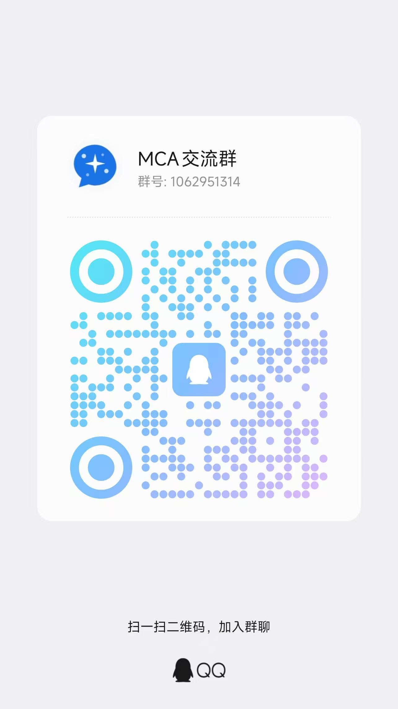

反馈问题时建议附上 MCA 版本、手机型号、芯片、Android 版本、模型名称、运行后端和错误截图。请勿公开 API Key、访问令牌或包含个人隐私的日志。

## Repository Layout

- `:app` - Android application, navigation, ViewModel, cloud/local providers.
- `:core:native` - `llama.cpp` C++/JNI bridge for GGUF-compatible local chat.
- `:core:sd-native` - `stable-diffusion.cpp` C++/JNI bridge for local image generation.
- `:core:engine` - single-active-generation inference service.
- `:core:modelstore` - MNN bundle and GGUF import, manifest, SHA-256, managed
  model storage.
- `:core:download` - ModelScope parsing, file listing, and resumable downloads.
- `:core:telemetry` - runtime metrics, SoC detection, and JSONL logging.
- `:core:deviceprofile` - device capability and thermal profiling.
- `:core:tuning` - parameter plan generation.
- `:core:benchmark` - short local benchmark runner.
- `:core:advisor` - local recommendation engine and agent logs.
- `:api:local` - AIDL service and loopback REST server skeleton.
- `:feature:chat` - chat and image-generation UI.
- `:feature:agent` - agent diagnostics UI.
- `:feature:modelhub` - model management UI.
- `:feature:settings` - runtime, logs, and local API UI.

## Build Requirements

- Android Studio or command-line Gradle.
- JDK 17.
- Android SDK with:
  - Android platform matching `compileSdk`.
  - Android build tools.
  - CMake 3.31.6 or compatible version configured by Gradle.
  - Android NDK matching `gradle/libs.versions.toml`.

Create a local `local.properties` file or set `ANDROID_HOME`:

```properties
sdk.dir=/path/to/android-sdk
```

`local.properties` is ignored by Git.

## Clone

This repository uses submodules for native inference backends:

```bash
git clone --recurse-submodules <repo-url>
cd mym
```

If you cloned without submodules:

```bash
git submodule update --init --recursive
```

## Build

PowerShell:

```powershell
$env:JAVA_HOME='<path-to-jdk-17>'
$env:ANDROID_HOME='<path-to-android-sdk>'
.\gradlew.bat :app:assembleDebug
```

Bash:

```bash
export JAVA_HOME=/path/to/jdk-17
export ANDROID_HOME=/path/to/android-sdk
./gradlew :app:assembleDebug
```

The debug APK is generated under:

```text
app/build/outputs/apk/debug/
```

## Native Backends

### Local Chat

MCA's product direction is **MNN CPU first, GGUF compatible**. Recommended
ModelScope chat models prefer MNN packages when a verified equivalent exists,
while user-supplied GGUF models continue to run through `llama.cpp`.
MNN chat models are handled as complete engine bundles: `config.json`,
`llm_config.json`, `llm.mnn`, `llm.mnn.weight`, and `tokenizer.txt` or
`tokenizer.mtok` must be present before MCA registers or loads the engine.

`core/native` builds `libmca_native.so` for the GGUF-compatible `llama.cpp`
path and `libmca_mnn_native.so` for the MNN CPU path. With `third_party/llama.cpp`
present, the module links the Android CPU backend for existing GGUF models. When
an official MNN Android LLM build is supplied through the Gradle/CMake MNN path
properties, the MNN runner is linked for `arm64-v8a`; otherwise the MNN JNI
library remains a clear stub so development builds fail loudly instead of
silently pretending to run. MNN OpenCL/GPU is not the default path.

### Local Image Generation

`core/sd-native` builds `libmca_sd_native.so` against
`third_party/stable-diffusion.cpp`. MCA stores its Android-specific patch in:

```text
third_party/patches/stable-diffusion.cpp-mca-android.patch
```

Gradle applies this patch when needed before the native CMake build.

Local image generation is model-bundle sensitive. Some newer image models need
a diffusion model plus VAE/AE and text encoder/LLM components in the same
engine directory. Compatibility is decided by the complete bundle contract and
the first real native load/graph execution. Unknown devices remain eligible and
use the generic compatible path; hardware detection only ranks packages and
selects runtime tuning.

## Model and API Compatibility

See [docs/MODEL_COMPATIBILITY.md](docs/MODEL_COMPATIBILITY.md) for the current
compatibility matrix covering local MNN/GGUF chat, OpenAI-compatible chat,
Anthropic Messages, cloud/local vision chat, OpenAI Images, DashScope Image,
custom image paths, and experimental local image bundles.

## Local API

MCA can expose the currently loaded local chat model through an
OpenAI-compatible API for trusted clients.

Use this when you want another app, browser, desktop client, or local tool to
talk to the model running on the phone.

Recommended client settings:

| Field | Value |
|---|---|
| Protocol | OpenAI-compatible |
| Same-device Base URL | `http://127.0.0.1:11435/v1` |
| Same-LAN Base URL | `http://<phone-lan-ip>:11435/v1` |
| API key | Generated inside MCA Settings -> Local API |
| Model | Pick from `/v1/models`, or enter the returned model `id` manually |

Supported paths:

- `GET /health`
- `GET /v1/models`
- `POST /v1/chat/completions`
- `GET /` for the built-in web chat page with text and image attachment input

`/v1/chat/completions` supports standard JSON responses and `stream=true`
Server-Sent Events. Same-LAN access requires enabling the in-app "open port"
switch and should only be used on trusted networks.

OpenAI-style image input is accepted for local API requests when the loaded
local model is either a complete MNN multimodal bundle with `visual.mnn`, or a
multimodal GGUF with a matching `mmproj` projector, and the native runner
reports vision ready. MCA accepts image parts in Chat Completions `messages`
and Responses-style `input` arrays. Image parts may use inline
`data:image/...;base64,...`, readable local paths, `file:` URLs, or reachable
`http(s)` image URLs. Android `content://` URIs should be converted to base64
or a readable file before sending through the local HTTP API. `/v1/models` also
exposes MCA extension fields such as `vision_ready` and `vision_projector` for
client-side diagnostics.

MNN multimodal vision uses the same default-open rule in the app and Local API:
on compatible ARM64 devices, image input is available whenever the complete
bundle loads and native reports `visionReady=true`. Per-device
`visionValidated` metadata is retained only for compatibility and does not
block image input; device-specific failures are handled as explicit exceptions.

The built-in web chat page can also attach browser-selected images. It sends
them as OpenAI-compatible `image_url` data URLs, making it a quick local vision
smoke-test surface after a multimodal local model is loaded and vision-ready.

To enable local vision in the app, load a complete MNN multimodal bundle, or
load a multimodal main GGUF and bind its matching `mmproj` / projector from the
local model card or the same model repository.

For cloud vision, enable "supports image input" only on cloud chat engines whose
provider and model documentation confirms multimodal image input.

## Privacy

- Local chat and local image generation run on device.
- Cloud chat and cloud image generation send prompts to the user-configured
  provider endpoint.
- Cloud API keys are stored locally with Android Keystore-backed encryption.
- The repository does not contain API keys, model weights, or private user data.

See [PRIVACY.md](PRIVACY.md) and [docs/PERMISSIONS.md](docs/PERMISSIONS.md) for
more detail.

## Roadmap

- **v0.1 alpha**: local chat, cloud chat, cloud image engines, image workspace,
  model management, ModelScope-oriented downloads, and release packaging.
- **v0.2 alpha**: smart web search, source cards, role-card assistants, local
  API compatibility fixes, web-search diagnostics, and release-grade
  compatibility documentation.
- **v0.3**: stabilize local image bundles, improve device compatibility
  reporting, and refine image generation progress/cancel behavior.

MCA intentionally avoids bundling model weights. Model recommendations and
download sources must respect each upstream model's license.

## Third-Party Code

The repository references upstream native projects through submodules:

- `llama.cpp` - MIT License.
- `stable-diffusion.cpp` - MIT License.

See [THIRD_PARTY_NOTICES.md](THIRD_PARTY_NOTICES.md).

## Contributing

MCA is early-stage and changes quickly. Please read
[CONTRIBUTING.md](CONTRIBUTING.md) before opening issues or pull requests.

## License

MCA is licensed under the MIT License. See [LICENSE](LICENSE).
