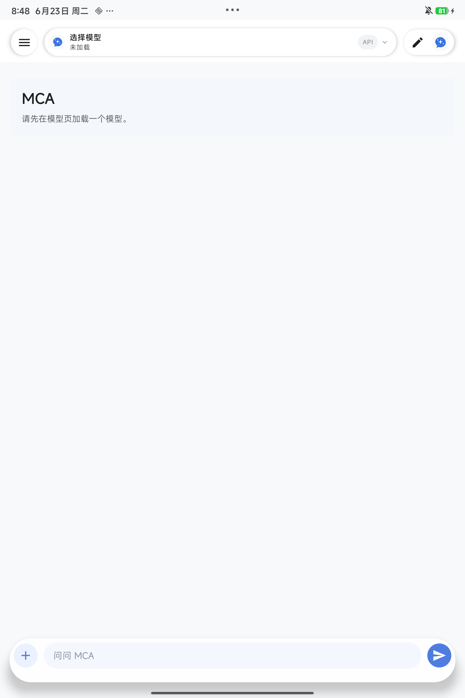

# MCA v0.1.0-alpha.1 Release Smoke Test

Clean install verification for the signed alpha APK.

## Result

| Item | Value |
|---|---|
| Result | Passed |
| Date | 2026-06-23 |
| APK | `mca-v0.1.0-alpha.1-arm64.apk` |
| APK SHA-256 | `5011badc5ce9d65349a8fd63b27f2630da10dffc4011ced2c02db0976c8517b2` |
| Package | `com.muyuchat.mca` |
| Version name | `0.1.0-alpha.1` |
| Version code | `1` |
| Installer | `com.miui.packageinstaller` |
| First install time | `2026-06-23 20:48:04` |
| Device model | `25091RP04C` |
| Device codename | `piano` |
| SoC property | `SM8750P` |
| Android version | `16` |
| Android SDK | `36` |

## Steps Verified

- Removed the previous differently signed `com.muyuchat.mca` package.
- Installed the signed `v0.1.0-alpha.1` release APK through the device package
  installer.
- Confirmed package metadata with `dumpsys package com.muyuchat.mca`.
- Launched the app through the Android launcher intent.
- Confirmed the clean first-run chat screen rendered without a crash.

## Evidence



Screenshot SHA-256:

```text
3fc41f7d7c89d3a125cb4f7f36352b42a61b79ea1a460719cd1b0324e68381b9
```
